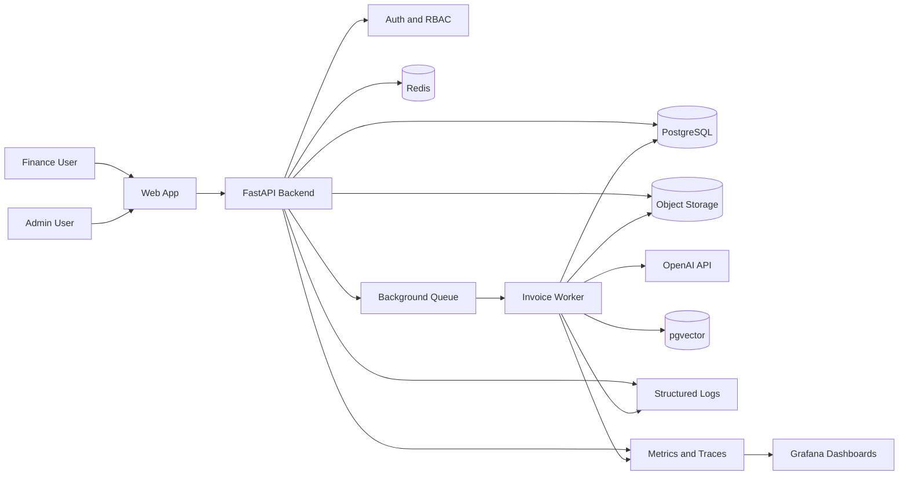

# Architecture Overview

Status: target-state architecture. For what is implemented today, see [Current Implementation Status](current-implementation-status.md).

## Purpose

The AI Invoice Processing Platform automates invoice intake, extraction, validation, review, and approval while keeping enterprise controls around security, auditability, reliability, and observability.

The system is designed to demonstrate production-grade engineering rather than a simple demo. Every invoice moves through a controlled processing pipeline with traceable state changes, retryable jobs, and human review for uncertain or risky cases.

## Target Users

- Finance operations teams uploading and reviewing invoices
- Approvers validating high-value or risky invoices
- Administrators managing suppliers, rules, and access
- Engineers operating the platform in staging and production

## High-Level Architecture



The diagram above is the intended production topology. The current repository implements only the backend shell, core invoice models, workflow rules, validation domain service, and audit-event builders.

## Core Components

### Web App

The web app provides upload, review, approval, rejection, dashboard, and administration workflows. It should not process invoices directly. It calls the backend API and displays the current invoice state.

Recommended stack:

- React, Next.js, or Vue
- Typed API client
- Role-aware navigation
- Review forms with field-level validation warnings

### Backend API

The backend owns all business rules and state transitions. It validates requests, enforces tenant isolation, writes audit logs, and creates background jobs.

Recommended stack:

- Python
- FastAPI
- Pydantic schemas
- SQLAlchemy
- Alembic migrations

### PostgreSQL

PostgreSQL is the system of record. It stores users, organizations, suppliers, invoices, extracted fields, validation results, review actions, audit logs, and processing jobs.

Use database constraints for important invariants such as duplicate invoice prevention within an organization and supplier.

### Redis and Background Queue

Invoice extraction should not run inside request-response API calls. Upload requests should return quickly after storing the file and creating a processing job.

Use Redis with Celery or RQ for:

- extraction jobs
- retries
- rate-limit handling
- asynchronous validation
- long-running document processing

### Object Storage

Original invoice files should be stored outside the application server in S3-compatible object storage.

Important controls:

- private buckets
- signed URLs
- checksum tracking
- file size limits
- MIME type validation
- encryption at rest

### AI Extraction Service

The AI extraction layer converts invoice documents into structured JSON. It should use strict schemas, prompt versions, confidence scores, and validation before persisting extracted fields.

The platform should store:

- prompt version
- model name
- extraction latency
- token usage
- estimated cost
- raw response reference
- structured extraction result
- overall and per-field confidence scores
- AI-assigned line-item expense categories

Extraction cost/quality controls (implemented):

- retrieval-augmented prompting: recent approved invoices from the same supplier are injected as few-shot layout examples, so reviewer corrections improve future extractions
- optional model tiering: a cheaper model runs first and the primary model is invoked only when confidence is low, with both calls' cost persisted
- image downscaling before the provider call for oversized uploads
- embedding reuse when identical source text was already embedded

### Validation Engine

The validation engine decides whether an invoice can move forward automatically or requires human review.

Example validation checks:

- required fields missing
- duplicate invoice number
- supplier not found
- invoice total mismatch
- tax mismatch
- amount above approval threshold
- supplier bank details mismatch
- purchase order/reference mismatch
- per-field extraction confidence below the review threshold
- invoice total far outside the supplier's approved history (amount anomaly)
- content nearly identical to another invoice (embedding near-duplicate)

Each failed rule carries a plain-language explanation and suggested fix for the reviewer (deterministic templates by default, optional LLM-written text).

### Agent Layer

Two AI-agent surfaces sit on one shared, transport-agnostic tool layer that calls the service layer only — so tenant isolation and RBAC are inherited, never reimplemented:

- an MCP (Model Context Protocol) server exposes search, invoice detail, similar-invoice, audit-trail, accuracy, failed-job, and reprocess tools to any MCP client, acting as a configured service user
- an in-product AP assistant (`POST /api/v1/assistant/ask`) chains read-only tool calls to answer operational questions, returning the tool trace with every answer

The assistant deliberately has no write tools; state-changing actions stay behind explicit human clicks in the cockpit.

### Human Review

Human review is required when extraction confidence is low, validation warnings are present, or approval policy requires manual action.

Invoices that pass every validation rule, survive anomaly detection, and meet the auto-approval confidence bar (overall and per-field) are approved automatically (touchless processing) with a dedicated `invoice.auto_approved` audit action, so machine approvals remain distinguishable from human ones.

Reviewers can:

- correct extracted fields
- approve invoice
- reject invoice
- add notes
- request changes

Every review action must be written to the audit log.

### Audit Log

The audit log is append-only at the application level. It records who did what, when, from where, and what changed.

Example events:

- invoice uploaded
- processing job created
- extraction completed
- validation failed
- anomaly flagged
- field corrected
- invoice approved
- invoice auto-approved
- invoice rejected

### Observability

The system should expose structured logs, metrics, and traces.

Key signals:

- request latency
- upload failure rate
- processing duration
- extraction failure rate
- queue depth
- retry count
- AI token cost
- approval turnaround time
- invoices requiring manual review
- auto-approval (touchless) rate
- anomaly flags by rule
- reviewer field corrections (extraction misses) by field
- model-tiering escalation count

## Invoice Lifecycle

```text
uploaded
queued
processing
extracted
validation_passed
review_required
approved
rejected
failed
```

State transitions should be explicit and protected by backend rules. The frontend should never directly set arbitrary invoice statuses.

## Recommended First Enterprise MVP

Build this first:

```text
Login
-> upload invoice
-> store file in object storage
-> create invoice and processing job
-> worker extracts structured data with AI
-> validation engine runs
-> reviewer edits fields
-> reviewer approves or rejects
-> audit log records every step
-> dashboard shows processing and failure states
```
